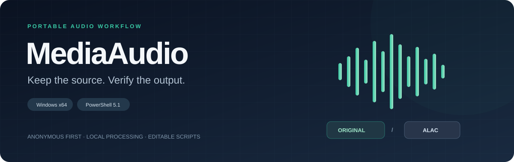
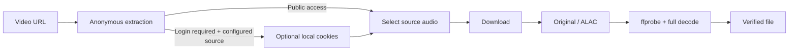

<p align="center"></p>

<p align="center">
  <a href="https://github.com/yyygdhg/MediaAudio/releases/tag/v0.1.0"></a>
  
  
  <a href="LICENSE"></a>
</p>

<p align="center"><b>English</b> · <a href="README.zh-CN.md">简体中文</a></p>
<p align="center"><a href="https://github.com/yyygdhg/MediaAudio/releases/tag/v0.1.0">Download</a> · <a href="docs/FAQ.md">Troubleshooting & cookies</a> · <a href="docs/VALIDATION.md">Validation</a> · <a href="THIRD_PARTY_NOTICES.md">Dependencies & licenses</a></p>

# Keep the source. Verify the output.

**MediaAudio turns a video link into a deliberate, verifiable audio workflow.** Preserve the original audio stream, or produce an ALAC file for an Apple-compatible library. Run locally, keep the scripts readable, and check the result before calling it finished.

Built for Windows users who want the capabilities of **yt-dlp + FFmpeg** without reconstructing the command line every time.

## What it does

| Capability | What happens |
| --- | --- |
| **Original stream** | Selects `bestaudio/best` using yt-dlp's quality ranking; retains the original codec and container where possible. A combined video/audio fallback is separated with stream copy. |
| **ALAC output** | Decodes the selected source and encodes ALAC in `.m4a`, retaining its sample rate and channel count. No normalization, EQ, denoising or audio filters are added. |
| **Verified completion** | Checks the codec, sample rate, channels and duration with ffprobe, then decodes the entire output with FFmpeg. |
| **Anonymous first** | Tries without cookies. A configured cookie source is used only after a recognized login/verification error. |
| **Portable workflow** | BAT + built-in PowerShell. No installer, administrator rights, PATH edits, or separate Python installation. |
| **Recoverable failures** | Keeps downloaded source/partial media when processing fails. Existing output files are not overwritten. |
| **Maintainable updates** | Tries yt-dlp's updater, falls back to official release assets with SHA256/version verification, and caches update checks. |

> **ALAC is a lossless output codec, not a restoration process.** YouTube and other sites commonly provide lossy Opus/AAC sources. Converting them to ALAC cannot recover information already lost. Use `original` to preserve the source as delivered.

## Start in three steps

1. Download **[MediaAudio-v0.1.0-Windows-x64.zip](https://github.com/yyygdhg/MediaAudio/releases/download/v0.1.0/MediaAudio-v0.1.0-Windows-x64.zip)** and extract the whole folder to a writable location.
2. Double-click **`MediaAudio.bat`**. On first launch, it downloads pinned dependencies from their upstream providers and verifies their SHA256 checksums. Allow a few minutes; internet access and roughly 1 GB of free space for initial preparation are recommended.
3. Paste a supported video URL. Verified audio is saved to **`%USERPROFILE%\Desktop`** by default.

The initial release ZIP contains project scripts and documentation, **not bundled third-party executables**. Dependencies stay in `bin/` after setup, and setup is skipped when all four required executables are present. You can also run `SetupDependencies.bat` ahead of time.

### Pick your output

Settings live in `config.ini`; if it is missing, the first run creates defaults. Open it in a text editor:

```ini
[General]
output_directory=%USERPROFILE%\Desktop
auto_update_ytdlp=true
download_playlist=false
cookies_from_browser=
cookies_file=
open_folder_when_finished=false
pause_after_finished=true
write_log=true

[Output]
output_mode=alac
```

| Setting | Choice |
| --- | --- |
| `output_mode=alac` | Default: ALAC `.m4a`, using the source sample rate and channels. |
| `output_mode=original` | Preserve the best available original audio stream. |
| `output_directory=D:\Music` | Choose your own folder; relative paths resolve from the tool's folder. |
| `download_playlist=true` | Opt into an entire playlist/multipart video. Default processes one item. |
| `cookies_file=` / `cookies_from_browser=` | Both are blank by default. See [FAQ](docs/FAQ.md) only when authentication is needed. |

Titles are retained, Windows-invalid characters are sanitized, and collisions receive a numeric suffix. No artist, song or year is guessed.

### Optional command-line use

```powershell
.\MediaAudio.bat -Url "https://www.youtube.com/watch?v=VIDEO_ID" -NoPause
.\UpdateYtDlp.bat -NoPause
```

## Scope and honest limits

- **Windows 10/11 x64; PowerShell 5.1.** Other operating systems and Windows ARM64 are not validated.
- **YouTube and Bilibili** have real extraction checks; the original workflow has also completed actual downloads and ALAC verification. Other sites depend on yt-dlp and are not individually validated by this project. See [test scope](docs/VALIDATION.md).
- Site policies, expired sessions, region/account restrictions and network problems can still prevent downloads. An update or cookie file is not a universal guarantee.
- This is a **local console tool** with an editable workflow. There is no web service, GUI, account system or telemetry upload.
- Logs can contain titles, video identifiers and local paths. Sensitive header values and signed query parameters are redacted; review logs before sharing.

## How the pieces fit



**MediaAudio owns the workflow; upstream projects provide the media engines.** yt-dlp extracts/downloads media, FFmpeg processes/decodes it, ffprobe reports parameters, and Node runs yt-dlp's JavaScript challenges.

## Development

Run `SetupDependencies.bat`, then these local checks in Windows PowerShell:

```powershell
powershell -NoProfile -ExecutionPolicy Bypass -File .\tests\Test-Dependencies.ps1
powershell -NoProfile -ExecutionPolicy Bypass -File .\scripts\Test-MediaAudio.ps1
powershell -NoProfile -ExecutionPolicy Bypass -File .\scripts\Test-Repair.ps1
```

Tests generate synthetic audio locally; no downloaded music is committed. Live site checks are separate because their results change over time. Read [CONTRIBUTING.md](CONTRIBUTING.md) before opening an issue, particularly if logs or cookies are involved.

## Project and credits

Created and maintained by **[Liminal / yyygdhg](https://github.com/yyygdhg)** with AI-assisted development. The product decisions, output guarantees and compatibility limits are documented so the project can be inspected and improved.

Project scripts, documentation and original artwork are under **[MIT](LICENSE)**. Third-party tools retain their own licenses; the Windows yt-dlp executable and the selected FFmpeg build include GPL obligations. The v0.1.0 publication avoids redistributing their binaries. Read **[THIRD_PARTY_NOTICES.md](THIRD_PARTY_NOTICES.md)** before making your own all-in-one bundle.

Use the tool only for media you are authorized to save, consistent with applicable law and the source site's terms.

<p align="center">A small workflow, with clear decisions and verifiable results.</p>
